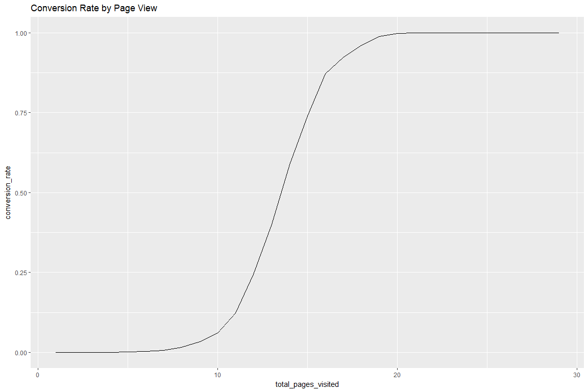
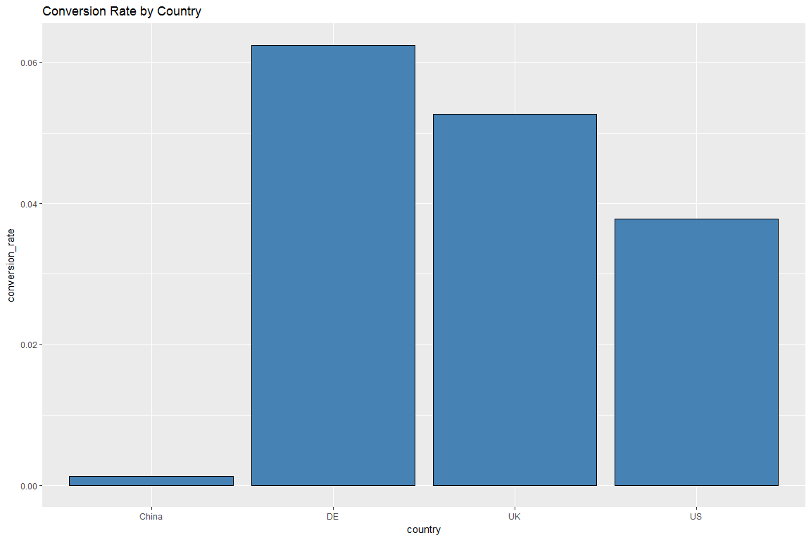
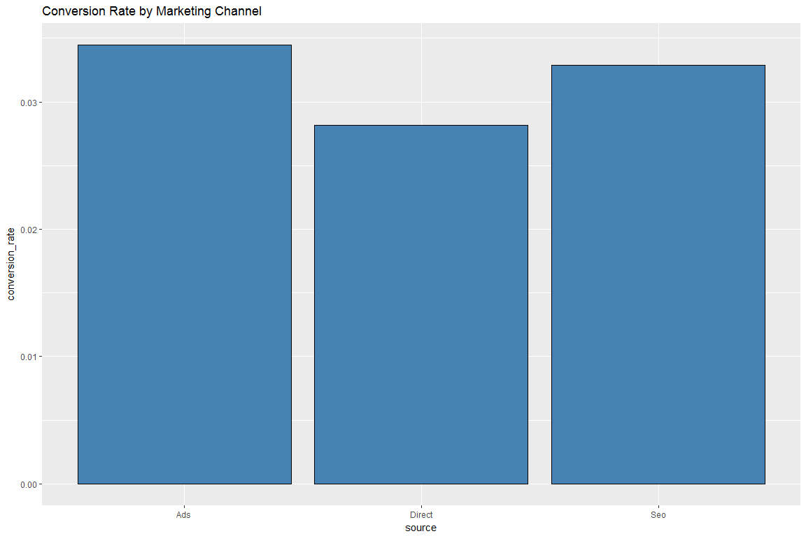
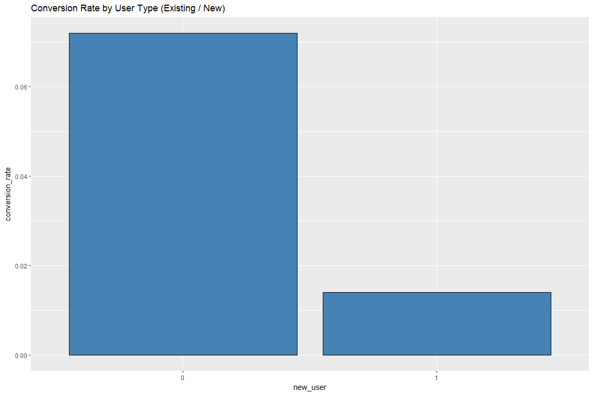
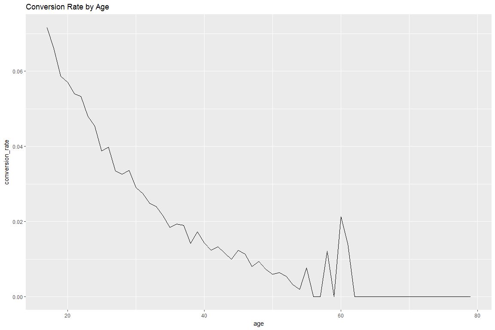
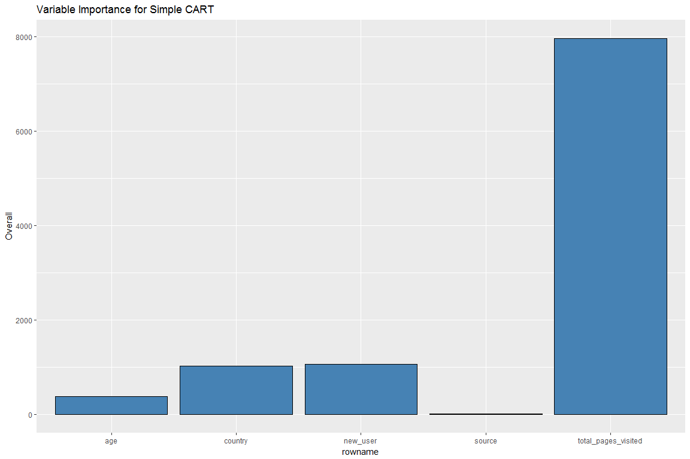
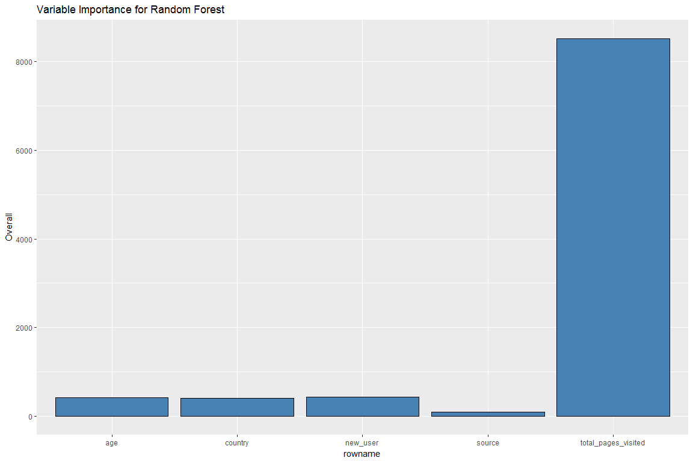
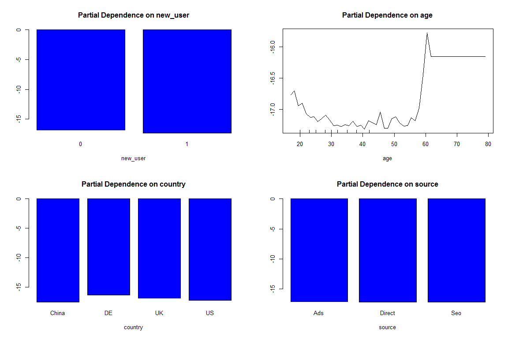

# Conversion Rate Optimization

In this project, we try to predict the conversion rate for customers visiting a particular site. Along with prediction, we give some recommendations to the marketing team to improve conversion going forward based on our analysis. The data contains information about one user session in each row. Each row contains the information about the customer being converted or not and other user attributes. Below are the attributes about each customer in a session:

* country - Country of the user.
* age - Age of the user.
* new_user - An indicator variable to denote if the user is an existing customer or a new one.
* source - marketing channel (Direct, Ads, SEO)
* total_pages_visited - number of pages visited during this session (using it as a proxy for user engagement with the site)

Two hypotheses immediately spring out:

* The more engaged a user is the more he likely it is that he will buy i.e. high numbers of total_pages_visited will lead to conversion.
* An existing user will be more likely to buy i.e. new_user = 0 would likey have higher conversion rate than new_user = 1.

## Insights from Data Exploration 


```
##   country            age         new_user      source      
##  China: 76602   Min.   : 17.00   0: 99456   Ads   : 88740  
##  DE   : 13056   1st Qu.: 24.00   1:216744   Direct: 72420  
##  UK   : 48450   Median : 30.00              Seo   :155040  
##  US   :178092   Mean   : 30.57                             
##                 3rd Qu.: 36.00                             
##                 Max.   :123.00                             
##  total_pages_visited   converted      
##  Min.   : 1.000      Min.   :0.00000  
##  1st Qu.: 2.000      1st Qu.:0.00000  
##  Median : 4.000      Median :0.00000  
##  Mean   : 4.873      Mean   :0.03226  
##  3rd Qu.: 7.000      3rd Qu.:0.00000  
##  Max.   :29.000      Max.   :1.00000
```
Maximum age is 123! This is highly unlikely. Check for all records greater where age is greater than 80.

### Data Cleanup

```
##   country age new_user source total_pages_visited converted
## 1      DE 123        0    Seo                  15         1
## 2      UK 111        0    Ads                  10         1
```
There are two records with unusually high value for age. Will remove from further analysis.

<!-- -->
Our hypothesis turns out to be correct. More pages a customer visits, more likely he is to buy.

<!-- -->
Germany has the highest conversion rate among the countries. China has the lowest.

<!-- -->
Ads and SEO have a slightly higher conversion rate although these might not be statistically significant.

<!-- -->
Our hypothesis about existing users buying more is confirmed here.

<!-- -->
The conversion rate keeps dexreasing as the age increases. However, around 30 years of age, it starts rapid decrease and there seems to be a different behavior after 55 years of age with unusual spikes in conversion.

## Model

I am choosing tree based models for this data because we need to provide good prediction as well as some insights for providing recommendation to the marketing teams. Tree based models are interpretable and highly accurate.


<!-- -->

```
## Confusion Matrix and Statistics
## 
##           Reference
## Prediction    No   Yes
##        No  76288   893
##        Yes   236  1632
##                                           
##                Accuracy : 0.9857          
##                  95% CI : (0.9849, 0.9865)
##     No Information Rate : 0.9681          
##     P-Value [Acc > NIR] : < 2.2e-16       
##                                           
##                   Kappa : 0.7358          
##  Mcnemar's Test P-Value : < 2.2e-16       
##                                           
##             Sensitivity : 0.64634         
##             Specificity : 0.99692         
##          Pos Pred Value : 0.87366         
##          Neg Pred Value : 0.98843         
##              Prevalence : 0.03194         
##          Detection Rate : 0.02065         
##    Detection Prevalence : 0.02363         
##       Balanced Accuracy : 0.82163         
##                                           
##        'Positive' Class : Yes             
## 
```

```
## Confusion Matrix and Statistics
## 
##           Reference
## Prediction    No   Yes
##        No  76234   772
##        Yes   290  1753
##                                           
##                Accuracy : 0.9866          
##                  95% CI : (0.9857, 0.9874)
##     No Information Rate : 0.9681          
##     P-Value [Acc > NIR] : < 2.2e-16       
##                                           
##                   Kappa : 0.7607          
##  Mcnemar's Test P-Value : < 2.2e-16       
##                                           
##             Sensitivity : 0.69426         
##             Specificity : 0.99621         
##          Pos Pred Value : 0.85805         
##          Neg Pred Value : 0.98997         
##              Prevalence : 0.03194         
##          Detection Rate : 0.02218         
##    Detection Prevalence : 0.02584         
##       Balanced Accuracy : 0.84523         
##                                           
##        'Positive' Class : Yes             
## 
```

<!-- -->
`total_pages_visited`, `new_user`, and `country` are the top three variables for predicting conversion.
<!-- -->
Partial Dependence Plot for the random forest model shows the same information as variable importance plot.

## Recommendations

* Germany has the highest conversion rate but not many german customers are visiting the site. The marketing team should target german customers and bring them to the site.
* The website is not working well for Chinese customers although there is large traffic from China. There might be some problem with the chinese website. The marketing team along with the technology team should further look into why is this happening and fix this as China has a large userbase which can drive conversions.
* It was seen that the conversion dropped for the users above 30 years. We should try to understand why the website is performing badly for people older than 30 years.
* As the website is driving conversions for young people, the marketing team should reach out to more younger customers through different channels.
* Existing users i.e. old customers are likely to buy more. So, a targeted mail campaign can be started to bring back older customers. They might be offered discounts.
* There are some users who have spent a lot of time on the site but have not bought anything yet. They can be the easiest customers to convert by providing them some offer.
